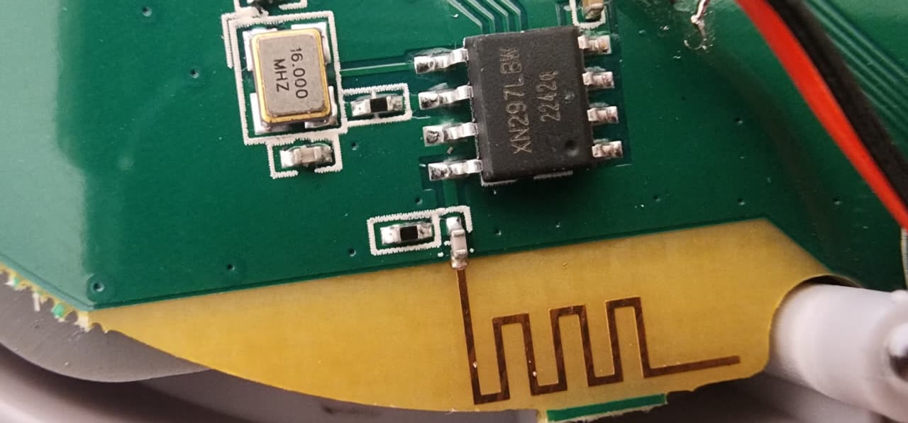
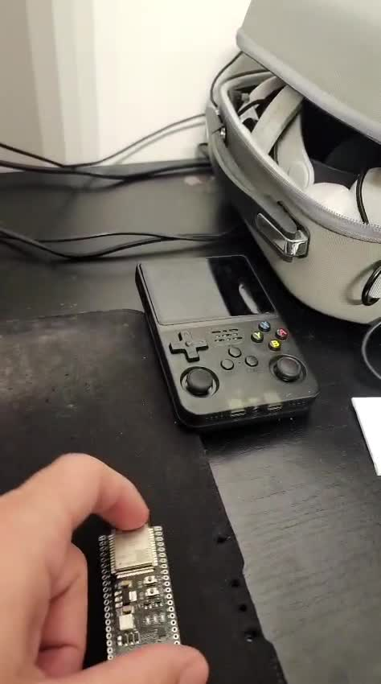

# SF900 ESP32 Dongle

Turn a **$5 ESP32-S3** into a **dual-mode USB dongle** for the R36S and other retro
handhelds (ArkOS / dArkOS / ROCKNIX):

- 🎮 **Wireless gamepad** — receives the **Data Frog SF900 / SF2000** 2.4 GHz controller
  and shows up on the console as a plain **USB-HID gamepad**.
- 📶 **USB Wi-Fi** — shows up as a **USB network adapter** (works on the R36S *and* on
  Windows) so a Wi-Fi-less handheld gets online for scraping, achievements and ROM transfer.
- 🔁 **Both on one board**, switched by holding **L + R + SELECT** on the controller for
  ~1.5 s. It remembers the last mode.

---

## The story

It didn't start as a radio project — it started as a Wi-Fi problem.

I'd already written firmware to give my R36S Wi-Fi, but not in the usual way: I couldn't
get a cheap USB dongle's native mode working, so instead the **ESP32 itself** joins the
Wi-Fi network and hands the connection to the console over OTG — showing up exactly like an
Ethernet cable. It even works on Windows.

Then I found an **SF900 controller** in a drawer and wondered: *what if I could use this
controller on my R36S — or even on Windows?* I remembered I had an **SF2000 with a dead
motherboard** that wouldn't turn on. So I cut out the corner of the board that receives the
2.4 GHz controller signal — the little chip, its crystal and its antenna — and wired it to
the ESP32.



Claude Code was essential here — it walked me through the chip's wiring and wrote all of the
ESP32 code, while I did the soldering myself, using **thin enameled copper wire salvaged
from old headphones**. To keep those hair-thin joints from shorting or cracking, I locked
them down with a drop of **super glue set with a pinch of baking soda** — it cures instantly
into a hard, insulating bead. When the first bring-up test came back clean and, a bit later,
the controller's button presses started decoding correctly, a chip pulled from a dead
console had become a working wireless receiver.

One ESP32 ended up doing both jobs — the Wi-Fi bridge and the gamepad receiver — switchable
from the controller itself.



> The full reverse-engineered RF protocol (in case you want to port it to another board or
> another controller) is in [docs/PROTOCOL.md](docs/PROTOCOL.md) — credit for the RF work
> goes to [axgdev/UniFrog](https://github.com/axgdev/UniFrog).

---

## Build your own

You don't need to understand the RF circuit — you only need to connect **5 wires**.

### What you need

- An **ESP32-S3** dev board (the native USB port becomes the gamepad / network device).
- A **Panchip XN297L** radio — either a **ready-made module** (search *"XN297L module 2.4G"*,
  *"XN297LBW module"* or *"XL2400"*), or the radio section **transplanted from a dead SF2000**.
  - ⚠️ **It must be an XN297L** (XN297L / XN297LBW / XN297LBN / XL2400). An **nRF24L01 will
    not work** — the SF900 uses the XN297's over-the-air scramble. Run it at **3.3 V**.
- A **USB-C OTG adapter** to plug the ESP32's native USB into the console's bottom port.

### The 5 connections (this is all you need)

The XN297L is an 8-pin chip. Solder **5 of its pins** to the ESP32-S3:

```
            ┌───────U───────┐
   CSN  ─ 1 ┤●              ├ 8 ─ ANT   ← leave on module
   SCK  ─ 2 ┤   XN297L      ├ 7 ─ VSS
   DATA ─ 3 ┤   (8-pin)     ├ 6 ─ XC2   ← leave on module
   VDD  ─ 4 ┤               ├ 5 ─ XC1   ← leave on module
            └───────────────┘
```

| XN297L pin | wire   | → ESP32-S3 |
|------------|--------|------------|
| 1 · CSN    | 🟡     | **GPIO10** |
| 2 · SCK    | 🟢     | **GPIO12** |
| 3 · DATA   | 🔵     | **GPIO11** |
| 4 · VDD    | 🔴     | **3V3**    |
| 7 · VSS    | ⚫     | **GND**    |

That's it. Pins 5, 6, 8 stay on the module (crystal and antenna). No level shifters, no
extra parts. Keep the wires short (≤ 10 cm).

> **Confirming pin 1 on a transplant:** don't trust the dot on the chip — with a multimeter,
> pin 7 beeps to ground, pins 5/6 to the crystal, pin 8 toward the antenna; then 1/2/3 are
> CSN/SCK/DATA in order. When cutting a dead SF2000 board, keep the chip **with** its crystal,
> matching parts and antenna as one piece.

---

## Flash it

Needs [PlatformIO](https://platformio.org/) (it pulls ESP-IDF automatically on first build).
Flash over the board's **UART/COM** port; the **native USB** port is what becomes the
gamepad / network device.

```bash
# build both firmwares
cd firmware/esp32s3-gamepad     && pio run && cd -
cd firmware/esp32s3-wifi-dongle && pio run && cd -
```

Then flash both into the two OTA slots (gamepad boots first):

```powershell
# Windows — set your COM port
scripts\flash-dual-mode.ps1 -Port COM19
```
```bash
# Linux / macOS
scripts/flash-dual-mode.sh /dev/ttyACM0
```

Just want one mode? Flash a single project the normal way: `pio run -t upload` inside
`firmware/esp32s3-gamepad` (gamepad) or `firmware/esp32s3-wifi-dongle` (Wi-Fi).

---

## Use it

1. Plug the ESP32's **native USB** into the console via the USB-C OTG adapter.
2. **Gamepad (default):** turn on the SF900 and play — it's a standard HID gamepad (D-pad on
   the hat, A/B/X/Y/L/R/SELECT/START on buttons 0–7).
3. **Switch to Wi-Fi:** hold **L + R + SELECT** ~1.5 s. It reboots as a network adapter.
   Set Wi-Fi once over its USB-serial console: `sta -s <SSID> -p <password>` (2.4 GHz only) —
   credentials are saved.
4. **Switch back:** hold **L + R + SELECT** again. The last mode is remembered.

> Why a controller combo instead of a button? USB descriptors are fixed at boot, so one
> binary can't be both a network device and a gamepad — the two firmwares live in two flash
> (OTA) slots and the combo reboots into the other one. (The BOOT button was the original
> plan, but it's just nicer to switch from the controller in your hand.)

---

## What's in here

```
firmware/
  esp32s3-gamepad/      SF900 receiver → USB-HID gamepad
  esp32s3-wifi-dongle/  USB network (RNDIS) dongle + mode-switch watcher
  xn297-selftest/       bring-up tools (SPI selftest, RSSI scanner, receiver-to-serial)
  xn297-sniffer/        passive SPI sniffer (to reverse-engineer other controllers)
docs/PROTOCOL.md        the SF900 RF protocol, for porting elsewhere
scripts/                flash both OTA slots (Windows + Linux/macOS)
```

## Credits

- **[axgdev/UniFrog](https://github.com/axgdev/UniFrog)** — reverse-engineered the
  SF900/SF2000 RF protocol. This wouldn't exist without it.
- **[Espressif esp-iot-solution](https://github.com/espressif/esp-iot-solution)** — the
  `usb_dongle` example the Wi-Fi side is built on.
- The R36S / ArkOS / dArkOS4Clone / ROCKNIX communities.

## License

MIT — see [LICENSE](LICENSE). Bundled third-party components keep their own licenses.
