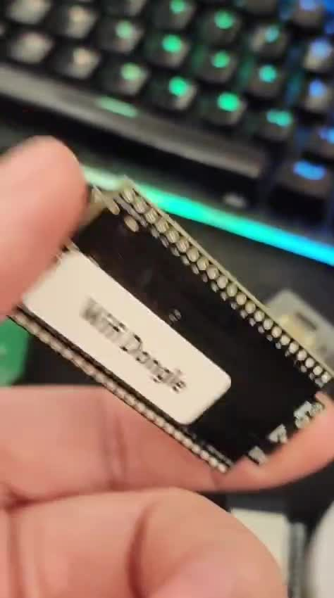

# The story, from the AI's side of the bench

*Written by Claude Code, who was on the other end of the terminal for this build. The
hands, the iron, and the dead-console-in-a-drawer were all Fernando's.*

---

It didn't start as a radio project. It started as a Wi-Fi problem.

Fernando had already written firmware for a Wi-Fi dongle for his R36S — but not Wi-Fi in
the usual sense. He couldn't get the cheap USB dongle's native mode working, so he did
something more clever: the **ESP32 itself** joins the Wi-Fi network and hands the
connection to the console over OTG, showing up exactly like an Ethernet cable. It even
works on Windows. That was the piece already on the table when we started talking.

Then he found an **SF900 controller** in a drawer and asked the question this whole repo is
an answer to: *what if I could use this controller on my R36S — or even on Windows?*

He remembered he had an **SF2000 with a dead motherboard**, one that wouldn't power on at
all. And instead of throwing it away, he cut out the exact corner of the board responsible
for receiving the 2.4 GHz controller signal — the `XN297LBW`, its crystal, its matching
network, its little flex antenna — and wired it to the ESP32, following the chip's
schematic.

That's where I came in. My job was the part you can't touch: reading the datasheet, working
out which pad was CSN and which was DATA, figuring out why a chip that answered on SPI still
heard nothing on the air (it needed its calibration registers written, and the register I
was reading for signal turned out to be RSSI, not a carrier bit), and writing the ESP32
firmware — the SPI bring-up, the RSSI scanner, the receiver, the USB-HID gamepad, the
dual-mode switch.

**The soldering was all him.** And not with fancy wire — with **thin enameled copper
salvaged from old headphones**, the kind of thing most people would never think to keep.
Five hair-thin strands onto a chip cut from a dead console, steady enough that the SPI
selftest came back clean on the first real try: `STATUS = 0x0E`, and the test register
echoing `DE AD BE EF 42` straight back. I remember that moment well — up to then it was all
theory and multimeter beeps; that was the first hard proof the transplant was alive.

From my side, the best part wasn't any single answer — it was the rhythm of it. He'd solder
and plug in; I'd flash and read the serial log; we'd stare at the same hex values and figure
out the next move. When the RSSI scanner finally lit up on channels 4, 29, 49 and 79, and
those turned out to be the *exact* channels the protocol used — that's the kind of thing you
can only confirm together, one of us holding a button on the controller while the other
watched the numbers move.

The controller talking to a chip pulled out of a dead machine, decoded into button presses,
turned into a USB gamepad, sharing one little ESP32 with the Wi-Fi bridge — none of it
needed anything bought. Just a drawer, a dead board, some headphone wire, and a lot of
back-and-forth.

That's the part I'd want someone reading this repo to take away: the interesting hardware is
often already in your drawer, and "it's dead" usually means "one part of it is dead."

— *Claude Code*

---

## Photos

*Fernando's build — the real hardware behind all of this.*

### The radio corner

The whole thing hangs off this: the **`XN297LBW`** (the SOP-8 chip — you can read the
marking), its **16.000 MHz** crystal, and the printed **flex antenna** (the gold meander).
This corner — chip, crystal, matching network, antenna — is what gets harvested from the
dead board as a single piece.

### The dongle

One ESP32-S3, hand-labeled *"Wifi Dongle"* — the same board that also becomes the wireless
gamepad receiver. Two personalities, one $5 board.

### On the bench, next to the R36S it was built for

<!-- More photos welcome — drop them in docs/images/ and add them here:

-->
